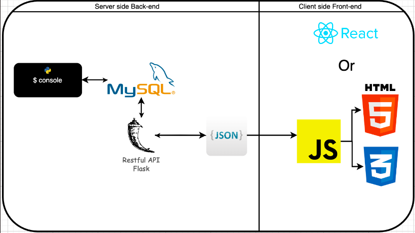

# EduNation

<p align="center">
  
</p>


EduNation is an online learning platform designed to ensure uninterrupted education by leveraging technology, developed by Oumaima Naanaa and Badr Annabi. This repository contains the backend codebase of EduNation.

## Table of Contents

- [Overview](#overview)
- [Technologies Used](#technologies-used)
- [Installation](#installation)


## Overview

In response to the educational disruptions faced during strikes and protests in Morocco in 2023, EduNation was born. The platform aims to facilitate seamless learning experiences for students and educators alike, even during challenging times.

## Technologies Used
<p align="center">
  
</p>
- **Backend**: SQLAlchemy with MySQL for ORM capabilities and database management.
- **Testing**: Unitest for rigorous backend testing.
- **API Design**: RESTful API design principles.
- **Version Control**: Git for version control and GitHub for repository hosting.

## Installation

1. Clone the repository:

```bash
git clone https://github.com/naanaa59/Edunation.git

